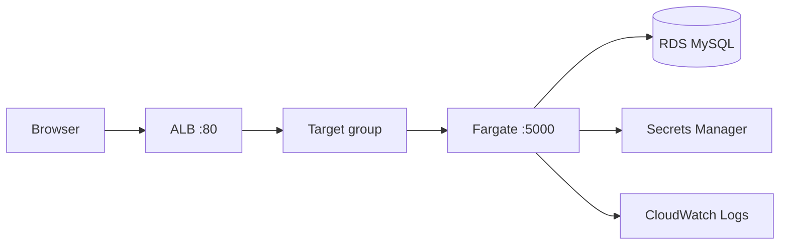

# Actions-TF-Fargate

A small **learning** project: **Terraform** provisions **VPC**, **RDS MySQL**, **Application Load Balancer**, and **ECS on Fargate**; **GitHub Actions** builds a **Flask** container and runs `terraform apply` using **OIDC** (no long-lived AWS keys in GitHub).

This README explains **what runs where**, **first-time setup** (local Terraform once, then GitHub Actions), **the end-to-end flow**, and **suggested labs** you can perform safely on your own account.

---

## What you will learn

| Topic | Where it lives |
|--------|----------------|
| Remote state + locking | `terraform/backend.tf` |
| VPC, subnets, routing, security groups | `terraform/vpc.tf` |
| RDS + DB subnet groups | `terraform/rds.tf` |
| Secrets Manager JSON for ECS | `terraform/rds.tf` |
| ALB, target group, HTTP listener | `terraform/alb.tf` |
| ECS cluster, task definition, service, logs | `terraform/ecs.tf` |
| GitHub OIDC → IAM role | `terraform/iam_github.tf` |
| CI pipeline | `.github/workflows/deploy.yaml` |
| Flask task list + SQLAlchemy + `/health` | `app/app.py` |

---

## Repository layout

```text
.
├── README.md
├── app/
│   ├── app.py              # Flask task list (/ uses RDS; /health does not)
│   ├── Dockerfile
│   ├── templates/
│   │   └── index.html
│   └── requirements.txt
├── terraform/
│   ├── *.tf                # Root Terraform module
│   └── .terraform.lock.hcl # Commit this; pin providers
└── .github/workflows/deploy.yaml
```

---

## Architecture (mental model)

**Runtime (when someone opens the site):**



**Deploy time (manual):** In GitHub you run the **Production Deploy** workflow (**Actions → Production Deploy → Run workflow**). It builds and pushes the image, runs Terraform from `terraform/`, and Terraform creates or updates the AWS resources above (including task definitions wired to Secrets Manager).

**Traffic path for the demo:** browser → **ALB** (port 80) → **Fargate task** (container port 5000) → **RDS** when you hit **`/`**. The ALB target group health check uses **`/health`**, which **does not** open a database connection (see `app/app.py`).

**Application database:** On startup the app runs SQLAlchemy **`create_all()`** for the **`task`** table. It also **`DROP TABLE IF EXISTS`** for legacy demo tables (**`visit`**, **`guestbook_entry`**) so upgraded deployments do not keep dead schema.

---

## Deploy and runtime flow

### 1) You start the workflow manually

In the GitHub UI: **Actions → Production Deploy → Run workflow**. GitHub checks out the repo at the selected branch (usually `main`).

### 2) AWS credentials via OIDC

The workflow job has `permissions: id-token: write`. The **configure-aws-credentials** action exchanges the GitHub OIDC token for temporary **STS** credentials by assuming the IAM role whose ARN is in **`AWS_ROLE_ARN`**.

### 3) Docker build and push

The **Docker** build uses **`app/`** as context, tags the image as:

- **`DOCKER_USERNAME/my-flask-app:<git-sha>`** (immutable; Terraform uses this tag)
- **`DOCKER_USERNAME/my-flask-app:latest`** (convenience only)

### 4) Terraform apply

From **`terraform/`**, Terraform:

1. Refreshes state from the **S3** backend (see `terraform/backend.tf`).
2. Ensures networking, RDS, secrets, ALB, ECS cluster/service, and IAM exist as declared.
3. Registers **new task definition revisions** when inputs change (for example **`TF_VAR_image_tag`** set to the commit SHA).

### 5) ECS rolls the service

The ECS service keeps **desired_count** tasks running. With **`deployment_circuit_breaker`** enabled, a bad revision fails fast instead of flapping indefinitely.

### 6) ALB sends traffic to healthy tasks

The target group health check calls **`/health`** on each task IP. When healthy, the listener forwards traffic on **port 80** to the tasks.

---

## Prerequisites

1. **AWS account** with permissions to create VPC, RDS, ECS, ELB, IAM, Secrets Manager, CloudWatch Logs, and (for bootstrap) IAM OIDC providers.
2. **S3 bucket** named in `terraform/backend.tf` (create it once in your account; the placeholder bucket name must be changed — S3 names are globally unique). Terraform **1.11+** is required for S3 native state locking (`use_lockfile` in `backend.tf`). No separate DynamoDB table is needed.
3. **GitHub repository** hosting this code.
4. **Docker Hub** account (username + access token or password for CI login).

---

## Setup (first time)

**Intended flow:** run **Terraform once on your laptop** to bootstrap AWS (and create the IAM role GitHub will assume). **Everything after that** — building the Docker image and running **`terraform apply`** — goes through **GitHub Actions** (**Production Deploy**).

The workflow needs **`AWS_ROLE_ARN`**, but that role is **created by** the first `terraform apply`. So the first apply uses **your** AWS credentials (`aws configure` or environment variables), not GitHub OIDC.

### On your laptop (bootstrap only)

1. **Terraform ≥ 1.11** (`terraform version`). Meet [Prerequisites](#prerequisites) (AWS account, S3 state bucket, GitHub repo, Docker Hub).

2. **State bucket:** Create a globally unique S3 bucket in **`us-east-1`**, set **`bucket`** in **`terraform/backend.tf`**, then:

```bash
cd terraform
terraform init
# If you changed backend.tf after a failed init: terraform init -reconfigure
```

3. **First apply** (still on the laptop):

```bash
export TF_VAR_db_password='choose-a-strong-password'
export TF_VAR_docker_username='your-dockerhub-username'
export TF_VAR_github_repository='YOUR_GITHUB_LOGIN/Actions-TF-Fargate'
terraform plan
terraform apply
```

Use normal **ASCII** quotes in `export` lines (not curly quotes pasted from email/docs). **`TF_VAR_github_repository`** must match this repo’s **`owner/name`**. If apply errors because a GitHub OIDC provider already exists in the account: **`export TF_VAR_use_existing_github_oidc_provider=true`** and apply again.

4. **Expectation:** Until GitHub has built and pushed the image, ECS may show failed tasks or the ALB may return **503**. That is normal right after bootstrap; the next step fixes it.

### In GitHub (after bootstrap)

1. Add the [GitHub Actions secrets](#github-actions-secrets). **`AWS_ROLE_ARN`** must be Terraform output **`github_actions_deploy_role_arn`** (the **deploy role**, not the OIDC provider ARN).

2. **Actions → Production Deploy → Run workflow.** It builds **`app/`**, pushes **`DOCKER_USERNAME/my-flask-app:<git-sha>`** (and **`:latest`**), and runs **`terraform apply`** with **`TF_VAR_image_tag`** set to that commit SHA.

3. Confirm the target group has a **healthy** target, then open **`alb_dns_name`** **`/health`** and **`/`** (from Terraform outputs). If something fails, check **ECS → Stopped task reason** and **CloudWatch** **`/ecs/<project_name>-app`** (default **`/ecs/myapp-app`**).

---

## Day-to-day (after setup)

Push to GitHub, then **Actions → Production Deploy → Run workflow**. Use that for **both** app changes and Terraform changes. Keep **`TF_VAR_db_password`** in GitHub aligned with the RDS password from bootstrap unless you are intentionally rotating it.

*(Optional: you can always run `terraform apply` from your laptop with AWS credentials instead of the workflow — this repo does not require that.)*

---

## GitHub Actions secrets

| Secret | Purpose |
|--------|---------|
| **`AWS_ROLE_ARN`** | IAM role ARN for OIDC (from Terraform output). |
| **`DOCKER_USERNAME`** | Docker Hub login; also **`TF_VAR_docker_username`**. |
| **`DOCKER_PASSWORD`** | Docker Hub password or token. |
| **`TF_VAR_db_password`** | RDS master password (same variable name Terraform expects). |

The workflow sets **`TF_VAR_image_tag`** to **`github.sha`** and **`TF_VAR_github_repository`** to **`github.repository`** automatically.

---

## After a successful deploy

Terraform prints **`alb_dns_name`** and **`alb_urls`**.

- Open **`http://<alb_dns_name>/health`** — should return JSON `{"status":"ok"}` without touching RDS.
- Open **`http://<alb_dns_name>/`** — **task list** UI backed by MySQL (add tasks, mark done, delete).

Use the AWS console in parallel:

1. **EC2 → Load Balancers** — target group attachment, health.
2. **ECS → Cluster → Service → Tasks** — task public IP, deployment events, stopped reason.
3. **CloudWatch Logs** — log group **`/ecs/<project_name>-app`** (default **`/ecs/myapp-app`** if you kept `project_name = "myapp"` in `terraform/variables.tf`).
4. **RDS** — endpoint, subnet group, security groups.

---

## Suggested learning labs (in order)

Each lab is a **single change** followed by **`terraform plan`** (always read the plan) and **`apply`** when you are ready. Keep the AWS console open for the same resource.

1. **Trace OIDC**  
   Temporarily set a wrong **`AWS_ROLE_ARN`** in GitHub and read the workflow error. Restore the correct ARN.

2. **Health check vs application route**  
   In `terraform/alb.tf`, set the target group health check **`path`** to **`/`** instead of **`/health`**. Apply, then stop RDS or break security groups and observe how ALB health differs. Change it back.

3. **Circuit breaker**  
   In `terraform/ecs.tf`, set **`deployment_circuit_breaker.enable`** to **`false`**, commit a deliberately broken **`Dockerfile`**, run the workflow manually, and compare ECS deployment behavior. Restore **`true`**.

4. **Security group direction**  
   Remove the **ingress** rule that allows ALB → task **:5000** and watch targets go unhealthy. Restore the rule.

5. **Immutable tags**  
   Watch how changing **`TF_VAR_image_tag`** creates a **new task definition revision** in ECS.

6. **State and imports (advanced)**  
   Pick one resource and practice **`terraform state mv`** or **`terraform import`** in a throwaway branch after reading the docs.

---

## Common commands

```bash
cd terraform
terraform fmt -recursive
terraform validate
terraform plan
terraform apply
```

Destroy when you are done experimenting (this deletes infrastructure):

```bash
terraform destroy
```

---

## Cost knobs (optional)

Learning is the priority; if you want to trim spend during idle weeks:

- Remove the **`setting` `containerInsights`** block from **`aws_ecs_cluster`** in `terraform/ecs.tf`.
- Tear down the stack with **`terraform destroy`** when not studying.

---

## Files worth reading first

1. **`README.md`** (this file) — flow and bootstrap.
2. **`terraform/vpc.tf`** — how traffic is allowed between ALB, tasks, and RDS.
3. **`terraform/ecs.tf`** — task definition, service, circuit breaker, grace period.
4. **`app/app.py`** and **`app/templates/index.html`** — **`/health`** vs **`/`** (task list + RDS) for load balancer behavior.

If something fails, capture **`terraform plan`** output, the **ECS service events**, and **target group health** details — that trio usually pinpoints the layer (Terraform vs ECS vs ALB vs RDS).
