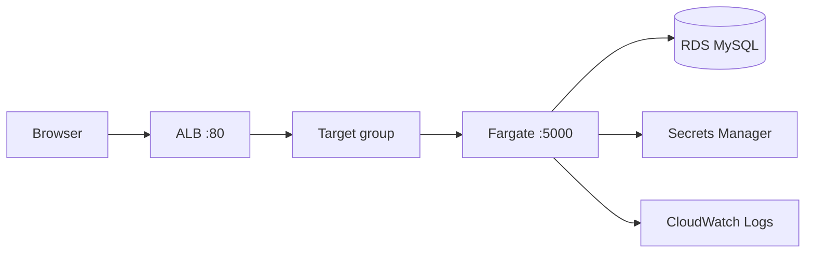

# Actions-TF-Fargate

A small **learning** project: **Terraform** provisions **VPC**, **RDS MySQL**, **Application Load Balancer**, and **ECS on Fargate**; **GitHub Actions** builds a **Flask** container and runs `terraform apply` using **OIDC** (no long-lived AWS keys in GitHub).

This README explains **what runs where**, **initial setup**, **subsequent deployments**, **the end-to-end flow**, and **suggested labs** you can perform safely on your own account.

---

## What you will learn

| Topic | Where it lives |
|--------|----------------|
| Remote state + locking | `terraform/backend.tf` |
| VPC, subnets, routing, security groups | `terraform/vpc.tf` |
| RDS + DB subnet groups | `terraform/rds.tf` |
| Secrets Manager JSON for ECS | `terraform/rds.tf` |
| ALB, target group, HTTP listener | `terraform/alb.tf` |
| ECS cluster, task definition, service, logs | `terraform/ecs.tf` |
| GitHub OIDC → IAM role | `terraform/iam_github.tf` |
| CI pipeline | `.github/workflows/deploy.yaml` |
| Flask task list + SQLAlchemy + `/health` | `app/app.py` |

---

## Repository layout

```text
.
├── README.md
├── app/
│   ├── app.py              # Flask task list (/ uses RDS; /health does not)
│   ├── Dockerfile
│   ├── templates/
│   │   └── index.html
│   └── requirements.txt
├── terraform/
│   ├── *.tf                # Root Terraform module
│   └── .terraform.lock.hcl # Commit this; pin providers
└── .github/workflows/deploy.yaml
```

---

## Architecture (mental model)

**Runtime (when someone opens the site):**



**Deploy time (manual):** In GitHub you run the **Production Deploy** workflow (**Actions → Production Deploy → Run workflow**). It builds and pushes the image, runs Terraform from `terraform/`, and Terraform creates or updates the AWS resources above (including task definitions wired to Secrets Manager).

**Traffic path for the demo:** browser → **ALB** (port 80) → **Fargate task** (container port 5000) → **RDS** when you hit **`/`**. The ALB target group health check uses **`/health`**, which **does not** open a database connection (see `app/app.py`).

**Application database:** On startup the app runs SQLAlchemy **`create_all()`** for the **`task`** table. It also **`DROP TABLE IF EXISTS`** for legacy demo tables (**`visit`**, **`guestbook_entry`**) so upgraded deployments do not keep dead schema.

---

## Deploy and runtime flow

### 1) You start the workflow manually

In the GitHub UI: **Actions → Production Deploy → Run workflow**. GitHub checks out the repo at the selected branch (usually `main`).

### 2) AWS credentials via OIDC

The workflow job has `permissions: id-token: write`. The **configure-aws-credentials** action exchanges the GitHub OIDC token for temporary **STS** credentials by assuming the IAM role whose ARN is in **`AWS_ROLE_ARN`**.

### 3) Docker build and push

The **Docker** build uses **`app/`** as context, tags the image as:

- **`DOCKER_USERNAME/my-flask-app:<git-sha>`** (immutable; Terraform uses this tag)
- **`DOCKER_USERNAME/my-flask-app:latest`** (convenience only)

### 4) Terraform apply

From **`terraform/`**, Terraform:

1. Refreshes state from the **S3** backend (see `terraform/backend.tf`).
2. Ensures networking, RDS, secrets, ALB, ECS cluster/service, and IAM exist as declared.
3. Registers **new task definition revisions** when inputs change (for example **`TF_VAR_image_tag`** set to the commit SHA).

### 5) ECS rolls the service

The ECS service keeps **desired_count** tasks running. With **`deployment_circuit_breaker`** enabled, a bad revision fails fast instead of flapping indefinitely.

### 6) ALB sends traffic to healthy tasks

The target group health check calls **`/health`** on each task IP. When healthy, the listener forwards traffic on **port 80** to the tasks.

---

## Prerequisites

1. **AWS account** with permissions to create VPC, RDS, ECS, ELB, IAM, Secrets Manager, CloudWatch Logs, and (for bootstrap) IAM OIDC providers.
2. **S3 bucket** named in `terraform/backend.tf` (create it once in your account; the placeholder bucket name must be changed — S3 names are globally unique). Terraform **1.11+** is required for S3 native state locking (`use_lockfile` in `backend.tf`). No separate DynamoDB table is needed.
3. **GitHub repository** hosting this code.
4. **Docker Hub** account (username + access token or password for CI login).

---

## Initial setup (first time) — do this in order

Goal: **AWS runs the stack** (VPC, RDS, ALB, ECS) and **at least one Fargate task is healthy** behind the ALB. Then **GitHub Actions** can take over for later deploys.

There is a **chicken-and-egg**: the workflow needs **`AWS_ROLE_ARN`**, but that role is **created by Terraform**. So the **first** `terraform apply` must use **normal AWS credentials** on your laptop (`aws configure` or environment variables), not OIDC from GitHub yet.

### 1) Install and check versions

- **Terraform ≥ 1.11** (`terraform version`) — required for S3 `use_lockfile` in `terraform/backend.tf`.
- **Docker on your laptop** — optional if you use **Option A** below (first image build happens in GitHub Actions).

### 2) Create the Terraform state bucket (once per account/region)

`terraform/backend.tf` references an S3 **bucket that must already exist** (name is globally unique).

```bash
export TF_STATE_BUCKET='your-globally-unique-bucket-name'
aws s3api create-bucket --bucket "$TF_STATE_BUCKET" --region us-east-1
aws s3api put-bucket-versioning --bucket "$TF_STATE_BUCKET" \
  --versioning-configuration Status=Enabled
```

When you type or paste any `export ...='...'` line in this guide, use a **normal keyboard apostrophe** `'` (ASCII). **“Smart” / curly quotes** from word processors or email often break the shell.

Edit **`terraform/backend.tf`**: set **`bucket`** to that name. From **`terraform/`**:

```bash
terraform init
# If you changed backend settings after a failed init:
# terraform init -reconfigure
```

### 3) Why an image is mentioned at all (and when you can skip local Docker)

**Fargate never builds your app.** It only **pulls** a container image from Docker Hub at the URI Terraform puts in the task definition:

**`<TF_VAR_docker_username>/my-flask-app:<TF_VAR_image_tag>`** (default tag **`latest`** in `terraform/variables.tf`).

So **some** computer must **`docker build` + `docker push`** at least once before ECS can run a healthy task. In this project that is usually **GitHub Actions**, not your laptop.

**Bootstrap order:** Terraform creates the **GitHub OIDC deploy role** on first apply, but GitHub cannot run that workflow until you add **`AWS_ROLE_ARN`**. So the **first** `terraform apply` (next step) often runs **before** any image exists. That can leave ECS **temporarily broken** (ALB **503**, failed tasks) until the **first successful “Production Deploy”** workflow run — **that is expected** if you skip local Docker.

Pick one:

| Option | Local `docker build` / `push`? | Typical experience |
|--------|----------------------------------|----------------------|
| **A — CI-first (recommended)** | **No.** | First `apply` may show unhealthy ECS until you add GitHub secrets and run **Production Deploy** once; the workflow builds and pushes **`:github.sha`** and **`:latest`**, then Terraform in CI points ECS at the SHA tag. |
| **B — Push `latest` once from laptop** | **Yes** (below). | Fewer “why is everything red?” hours: an image exists before first `apply`, so targets often go **healthy** before you wire Actions. |

**Option B — only if you want a local image first**

```bash
cd app
docker build -t YOUR_DOCKERHUB_USERNAME/my-flask-app:latest .
docker login   # Docker Hub
docker push YOUR_DOCKERHUB_USERNAME/my-flask-app:latest
```

If you use another tag, set **`export TF_VAR_image_tag='that-tag'`** before `terraform apply` and push **`...:that-tag`**.

### 4) First `terraform apply` (laptop AWS credentials)

```bash
cd terraform
export TF_VAR_db_password='choose-a-strong-password'
export TF_VAR_docker_username='your-dockerhub-username'
export TF_VAR_github_repository='YOUR_GITHUB_LOGIN/Actions-TF-Fargate'
# optional if not using default "latest":
# export TF_VAR_image_tag='latest'

terraform plan
terraform apply
```

Notes:

- **`TF_VAR_github_repository`** must equal this repo’s **`owner/name`** exactly (same as `github.repository` in Actions).
- If apply errors because an OIDC provider for **`token.actions.githubusercontent.com`** already exists in the account, set **`TF_VAR_use_existing_github_oidc_provider=true`** and apply again.

### 5) Confirm the runtime (before blaming “the code”)

If you used **Option A** and have **not** run **Production Deploy** yet, ECS may still be failing — add GitHub secrets (**step 6**) and run the workflow (**step 7**) first, then re-check here.

In the AWS console:

1. **Secrets Manager** → secret **`{project_name}/prod/db-creds`** (default **`myapp/prod/db-creds`**) → a **current** secret value exists (**`AWSCURRENT`**).
2. **ECS** → cluster → service → **Deployments / Events** — no repeating “unable to pull” / “ResourceInitializationError”.
3. **EC2 → Target groups** → your app target group → **Targets** — at least one **healthy** (health check **`/health`**).
4. Open **`http://<alb_dns_name>/health`** then **`/`** (Terraform prints **`alb_dns_name`** / **`alb_urls`**).

If targets stay empty or **Unhealthy**, read **ECS → Stopped task → Stopped reason** and **CloudWatch** log group **`/ecs/<project_name>-app`** (default **`/ecs/myapp-app`**).

### 6) Wire GitHub Actions (after the first apply succeeds)

1. Copy Terraform output **`github_actions_deploy_role_arn`** (the **deploy role** ARN — not the OIDC provider ARN).
2. GitHub → **Settings → Secrets and variables → Actions** — create all secrets in the table below (**[GitHub Actions secrets](#github-actions-secrets)**).

After **`AWS_ROLE_ARN`** is set, **manual workflow runs** can deploy **without** long-lived AWS keys in GitHub.

### 7) First deploy from GitHub (recommended next step)

**Actions → Production Deploy → Run workflow**. That run:

- Builds the image from **`app/`**, pushes **`DOCKER_USERNAME/my-flask-app:<git-sha>`** and **`:latest`**.
- Runs **`terraform apply`** with **`TF_VAR_image_tag=${{ github.sha }}`** so ECS pulls the **immutable SHA tag** (avoids “I pushed `:latest` but Fargate did not pick it up” surprises).

---

## Subsequent deployments (ongoing)

### Normal path: GitHub Actions (use this day-to-day)

1. Commit and push to **`main`** (or the branch you run the workflow from).
2. **Actions → Production Deploy → Run workflow** (manual dispatch).
3. Wait for green job: new image (**`:github.sha`**) + Terraform apply.
4. Quick verify: **target group healthy**, **`/health`**, then **`/`**.

Keep **`TF_VAR_db_password`** in GitHub secrets **aligned** with the password Terraform used when RDS was first created. Changing it later intentionally means **`terraform apply`** updating the DB password and secret — do that only when you mean to.

### Laptop-only deploy (optional)

Use when you want to change infra or image **without** Actions:

```bash
cd app
docker build -t YOUR_DOCKERHUB_USERNAME/my-flask-app:YOUR_TAG .
docker push YOUR_DOCKERHUB_USERNAME/my-flask-app:YOUR_TAG

cd ../terraform
export TF_VAR_db_password='...'   # same as before unless rotating
export TF_VAR_docker_username='...'
export TF_VAR_github_repository='owner/repo'
export TF_VAR_image_tag='YOUR_TAG'
terraform apply
```

**Caveat:** If you always use the tag **`latest`**, ECS may **not** redeploy when the digest behind `latest` changes. Prefer **unique tags** (the workflow’s **git SHA**) or **ECS → Update service → Force new deployment** after a `latest` push.

### Changing only Terraform (no app code)

- **With Actions:** push Terraform edits to GitHub, run **Production Deploy** (it still rebuilds the image; harmless).
- **Without Actions:** `terraform plan` / `apply` from **`terraform/`** with laptop credentials.

### Changing only application code

Push to GitHub, run **Production Deploy**. The new **`github.sha`** image tag forces ECS to roll.

---

## GitHub Actions secrets

| Secret | Purpose |
|--------|---------|
| **`AWS_ROLE_ARN`** | IAM role ARN for OIDC (from Terraform output). |
| **`DOCKER_USERNAME`** | Docker Hub login; also **`TF_VAR_docker_username`**. |
| **`DOCKER_PASSWORD`** | Docker Hub password or token. |
| **`TF_VAR_db_password`** | RDS master password (same variable name Terraform expects). |

The workflow sets **`TF_VAR_image_tag`** to **`github.sha`** and **`TF_VAR_github_repository`** to **`github.repository`** automatically.

---

## After a successful deploy

Terraform prints **`alb_dns_name`** and **`alb_urls`**.

- Open **`http://<alb_dns_name>/health`** — should return JSON `{"status":"ok"}` without touching RDS.
- Open **`http://<alb_dns_name>/`** — **task list** UI backed by MySQL (add tasks, mark done, delete).

Use the AWS console in parallel:

1. **EC2 → Load Balancers** — target group attachment, health.
2. **ECS → Cluster → Service → Tasks** — task public IP, deployment events, stopped reason.
3. **CloudWatch Logs** — log group **`/ecs/<project_name>-app`** (default **`/ecs/myapp-app`** if you kept `project_name = "myapp"` in `terraform/variables.tf`).
4. **RDS** — endpoint, subnet group, security groups.

---

## Suggested learning labs (in order)

Each lab is a **single change** followed by **`terraform plan`** (always read the plan) and **`apply`** when you are ready. Keep the AWS console open for the same resource.

1. **Trace OIDC**  
   Temporarily set a wrong **`AWS_ROLE_ARN`** in GitHub and read the workflow error. Restore the correct ARN.

2. **Health check vs application route**  
   In `terraform/alb.tf`, set the target group health check **`path`** to **`/`** instead of **`/health`**. Apply, then stop RDS or break security groups and observe how ALB health differs. Change it back.

3. **Circuit breaker**  
   In `terraform/ecs.tf`, set **`deployment_circuit_breaker.enable`** to **`false`**, commit a deliberately broken **`Dockerfile`**, run the workflow manually, and compare ECS deployment behavior. Restore **`true`**.

4. **Security group direction**  
   Remove the **ingress** rule that allows ALB → task **:5000** and watch targets go unhealthy. Restore the rule.

5. **Immutable tags**  
   Watch how changing **`TF_VAR_image_tag`** creates a **new task definition revision** in ECS.

6. **State and imports (advanced)**  
   Pick one resource and practice **`terraform state mv`** or **`terraform import`** in a throwaway branch after reading the docs.

---

## Common commands

```bash
cd terraform
terraform fmt -recursive
terraform validate
terraform plan
terraform apply
```

Destroy when you are done experimenting (this deletes infrastructure):

```bash
terraform destroy
```

---

## Cost knobs (optional)

Learning is the priority; if you want to trim spend during idle weeks:

- Remove the **`setting` `containerInsights`** block from **`aws_ecs_cluster`** in `terraform/ecs.tf`.
- Tear down the stack with **`terraform destroy`** when not studying.

---

## Files worth reading first

1. **`README.md`** (this file) — flow and bootstrap.
2. **`terraform/vpc.tf`** — how traffic is allowed between ALB, tasks, and RDS.
3. **`terraform/ecs.tf`** — task definition, service, circuit breaker, grace period.
4. **`app/app.py`** and **`app/templates/index.html`** — **`/health`** vs **`/`** (task list + RDS) for load balancer behavior.

If something fails, capture **`terraform plan`** output, the **ECS service events**, and **target group health** details — that trio usually pinpoints the layer (Terraform vs ECS vs ALB vs RDS).
