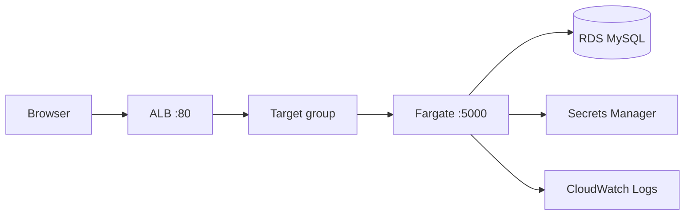

# Actions-TF-Fargate

A small **learning** project: **Terraform** provisions **VPC**, **RDS MySQL**, **Application Load Balancer**, and **ECS on Fargate**; **GitHub Actions** builds a **Flask** container and runs `terraform apply` using **OIDC** (no long-lived AWS keys in GitHub).

The **IAM OIDC provider** and **GitHub deploy role** are **not** managed by Terraform here. You create them **once in the AWS console** (or your company’s equivalent bootstrap), then store the role ARN in GitHub.

This README explains **what runs where**, **the end-to-end flow**, **one-time bootstrap**, and **suggested labs** you can perform safely on your own account.

---

## What you will learn

| Topic | Where it lives |
|--------|----------------|
| Remote state + locking | `terraform/backend.tf` |
| VPC, subnets, routing, security groups | `terraform/vpc.tf` |
| RDS + DB subnet groups | `terraform/rds.tf` |
| Secrets Manager JSON for ECS | `terraform/rds.tf` |
| ALB, target group, HTTP listener | `terraform/alb.tf` |
| ECS cluster, task definition, service, logs | `terraform/ecs.tf` |
| GitHub OIDC → IAM (manual in AWS console) | README bootstrap below |
| CI pipeline | `.github/workflows/deploy.yaml` |
| Flask + SQLAlchemy + health endpoint | `app/app.py` |

---

## Repository layout

```text
.
├── README.md
├── app/
│   ├── app.py              # Flask app (/ hits DB, /health does not)
│   ├── Dockerfile
│   └── requirements.txt
├── terraform/
│   ├── *.tf                # Root Terraform module
│   └── .terraform.lock.hcl # Commit this; pin providers
└── .github/workflows/deploy.yaml
```

---

## Architecture (mental model)

**Runtime (when someone opens the site):**



**Deploy time (manual):** In GitHub you run the **Production Deploy** workflow (**Actions → Production Deploy → Run workflow**). It builds and pushes the image, runs Terraform from `terraform/`, and Terraform creates or updates the AWS resources above (including task definitions wired to Secrets Manager).

**Traffic path for the demo:** browser → **ALB** (port 80) → **Fargate task** (container port 5000) → **RDS** when you hit **`/`**. The ALB target group health check uses **`/health`**, which **does not** open a database connection (see `app/app.py`).

---

## Deploy and runtime flow

### 1) You start the workflow manually

In the GitHub UI: **Actions → Production Deploy → Run workflow**. GitHub checks out the repo at the selected branch (usually `main`).

### 2) AWS credentials via OIDC

The workflow job has `permissions: id-token: write`. The **configure-aws-credentials** action exchanges the GitHub OIDC token for temporary **STS** credentials by assuming the IAM role whose ARN is in **`AWS_ROLE_ARN`** (that role must already exist; see bootstrap).

### 3) Docker build and push

The **Docker** build uses **`app/`** as context, tags the image as:

- **`DOCKER_USERNAME/my-flask-app:<git-sha>`** (immutable; Terraform uses this tag)
- **`DOCKER_USERNAME/my-flask-app:latest`** (convenience only)

### 4) Terraform apply

From **`terraform/`**, Terraform:

1. Refreshes state from the **S3** backend (see `terraform/backend.tf`).
2. Ensures networking, RDS, secrets, ALB, ECS cluster/service, and the **ECS task execution** IAM role exist as declared.
3. Registers **new task definition revisions** when inputs change (for example **`TF_VAR_image_tag`** set to the commit SHA).

### 5) ECS rolls the service

The ECS service keeps **desired_count** tasks running. With **`deployment_circuit_breaker`** enabled, a bad revision fails fast instead of flapping indefinitely.

### 6) ALB sends traffic to healthy tasks

The target group health check calls **`/health`** on each task IP. When healthy, the listener forwards traffic on **port 80** to the tasks.

---

## Prerequisites

1. **AWS account** with permission to create the resources in this Terraform stack (VPC, RDS, ECS, ELB, IAM roles for ECS, Secrets Manager, CloudWatch Logs) and to complete the **IAM OIDC bootstrap** in the console.
2. **S3 bucket + DynamoDB table** for remote state, matching `terraform/backend.tf` (create them in the console or any way you prefer before the first successful `terraform init` from CI).
3. **GitHub repository** hosting this code.
4. **Docker Hub** account (username + access token or password for CI login).

---

## One-time bootstrap (AWS console + GitHub)

Terraform in this repository **does not** create the GitHub OIDC identity provider or the **deploy** IAM role. That matches how many teams do **platform bootstrap**: identity wiring is done once outside the app Terraform, then application pipelines only **assume** an existing role.

Do these steps **before** the first successful **Production Deploy** workflow run.

### Step 0 — Remote state bucket and lock table (if you use the S3 backend)

Edit `terraform/backend.tf` to use **your** bucket name and lock table name, then in the AWS console (or CLI):

1. **S3** — Create the bucket in your chosen region, enable **versioning** (recommended for state), and default encryption if you like.
2. **DynamoDB** — Create a table used for state locking: partition key **`LockID`** (string), same region as the bucket. Point `dynamodb_table` in `backend.tf` at this table name.

Until the bucket exists, `terraform init` from Actions will fail when it tries to configure the backend.

### Step 1 — IAM OIDC identity provider for GitHub

1. Open **IAM → Identity providers → Add provider**.
2. Choose **OpenID Connect**.
3. **Provider URL:** `https://token.actions.githubusercontent.com`
4. **Audience:** `sts.amazonaws.com`
5. **Thumbprints:** Add the thumbprint(s) GitHub documents for this integration. The official guide is here: [Configuring OpenID Connect in Amazon Web Services](https://docs.github.com/en/actions/deployment/security-hardening-your-deployments/configuring-openid-connect-in-amazon-web-services). Some AWS console flows can fetch a thumbprint for you; if in doubt, follow GitHub’s current list in that doc.

Save the provider. Note your **12-digit AWS account ID** (top-right in the console); you need it for the trust policy in the next step.

### Step 2 — IAM role trusted by GitHub Actions

1. Open **IAM → Roles → Create role**.
2. **Trusted entity type:** **Web identity**.
3. **Identity provider:** select **`token.actions.githubusercontent.com`** (the provider you added).
4. **Audience:** `sts.amazonaws.com`.

Then replace the generated trust policy with one that **pins your repository** (adjust `YOUR_GITHUB_ORG`, `YOUR_REPO_NAME`, and `ACCOUNT_ID`):

```json
{
  "Version": "2012-10-17",
  "Statement": [
    {
      "Effect": "Allow",
      "Principal": {
        "Federated": "arn:aws:iam::ACCOUNT_ID:oidc-provider/token.actions.githubusercontent.com"
      },
      "Action": "sts:AssumeRoleWithWebIdentity",
      "Condition": {
        "StringEquals": {
          "token.actions.githubusercontent.com:aud": "sts.amazonaws.com"
        },
        "StringLike": {
          "token.actions.githubusercontent.com:sub": "repo:YOUR_GITHUB_ORG/YOUR_REPO_NAME:*"
        }
      }
    }
  ]
}
```

For a learning repo, attaching **`PowerUserAccess`** is common; for real organizations you would attach a **scoped** policy listing only what `terraform apply` needs.

Create the role and copy its **ARN** (for example `arn:aws:iam::123456789012:role/github-actions-deploy`).

### Step 3 — GitHub secret

In GitHub: **Settings → Secrets and variables → Actions**, create **`AWS_ROLE_ARN`** with the role ARN from Step 2.

### Step 4 — Run the workflow

**Actions → Production Deploy → Run workflow.** That run performs the first (or next) `terraform apply` using OIDC—no AWS access keys stored in GitHub.

---

## GitHub Actions secrets

| Secret | Purpose |
|--------|---------|
| **`AWS_ROLE_ARN`** | IAM role ARN GitHub assumes via OIDC (from console Step 2). |
| **`DOCKER_USERNAME`** | Docker Hub login; also **`TF_VAR_docker_username`**. |
| **`DOCKER_PASSWORD`** | Docker Hub password or token. |
| **`TF_VAR_db_password`** | RDS master password (same variable name Terraform expects). |

The workflow sets **`TF_VAR_image_tag`** to **`github.sha`** automatically.

---

## After a successful deploy

Terraform prints **`alb_dns_name`** and **`alb_urls`**.

- Open **`http://<alb_dns_name>/health`** — should return JSON `{"status":"ok"}` without touching RDS.
- Open **`http://<alb_dns_name>/`** — increments a counter stored in MySQL.

Use the AWS console in parallel:

1. **EC2 → Load Balancers** — target group attachment, health.
2. **ECS → Cluster → Service → Tasks** — task public IP, deployment events, stopped reason.
3. **CloudWatch Logs** — log group `/ecs/<project>-app`.
4. **RDS** — endpoint, subnet group, security groups.

---

## Suggested learning labs (in order)

Each lab is a **single change** followed by **`terraform plan`** (always read the plan) and **`apply`** when you are ready. Keep the AWS console open for the same resource.

1. **Trace OIDC**  
   Temporarily set an wrong **`AWS_ROLE_ARN`** in GitHub and read the workflow error. Restore the correct ARN.

2. **Health check vs application route**  
   In `terraform/alb.tf`, set the target group health check **`path`** to **`/`** instead of **`/health`**. Apply, then stop RDS or break security groups and observe how ALB health differs. Change it back.

3. **Circuit breaker**  
   In `terraform/ecs.tf`, set **`deployment_circuit_breaker.enable`** to **`false`**, commit a deliberately broken **`Dockerfile`**, run the workflow manually, and compare ECS deployment behavior. Restore **`true`**.

4. **Security group direction**  
   Remove the **ingress** rule that allows ALB → task **:5000** and watch targets go unhealthy. Restore the rule.

5. **Immutable tags**  
   Watch how changing **`TF_VAR_image_tag`** creates a **new task definition revision** in ECS.

6. **State and imports (advanced)**  
   Pick one resource and practice **`terraform state mv`** or **`terraform import`** in a throwaway branch after reading the docs.

---

## Common commands

```bash
cd terraform
terraform fmt -recursive
terraform validate
terraform plan
terraform apply
```

Destroy when you are done experimenting (this deletes infrastructure):

```bash
terraform destroy
```

---

## Cost knobs (optional)

Learning is the priority; if you want to trim spend during idle weeks:

- Remove the **`setting` `containerInsights`** block from **`aws_ecs_cluster`** in `terraform/ecs.tf`.
- Tear down the stack with **`terraform destroy`** when not studying.

---

## Files worth reading first

1. **`README.md`** (this file) — flow and bootstrap.
2. **`terraform/vpc.tf`** — how traffic is allowed between ALB, tasks, and RDS.
3. **`terraform/ecs.tf`** — task definition, service, circuit breaker, grace period.
4. **`app/app.py`** — **`/health`** vs **`/`** split for load balancer behavior.

If something fails, capture **`terraform plan`** output, the **ECS service events**, and **target group health** details — that trio usually pinpoints the layer (Terraform vs ECS vs ALB vs RDS).
